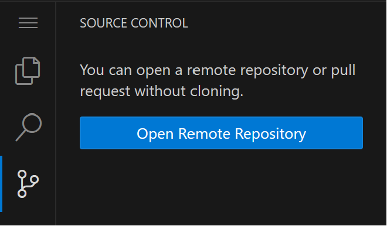
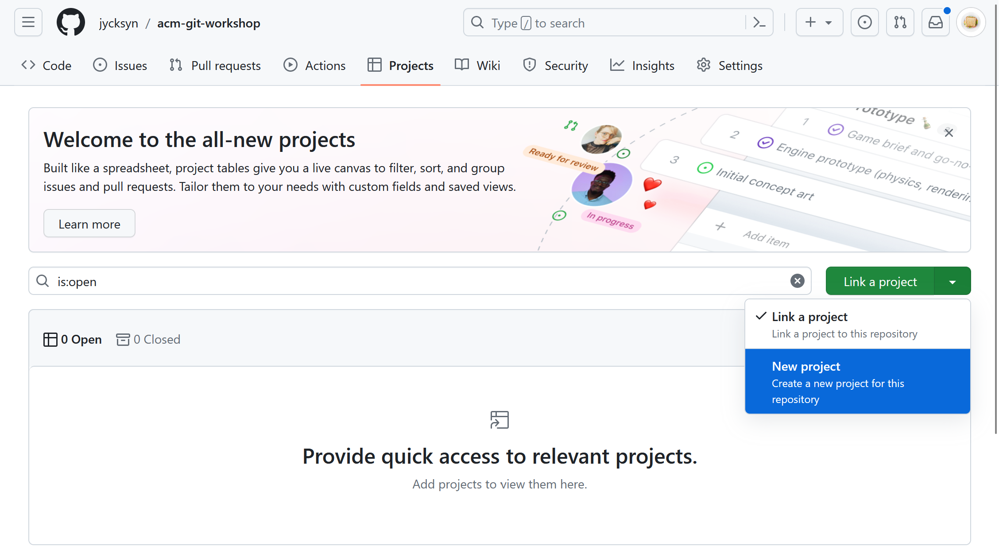

# **Git Organized! A GitHub Projects Adventure**
### William & Mary ACM

#### 04/13/2023

---

# **Road Map**

1. Git / GitHub Projects Workshop (~7:05)
2. Gartic Phone! (~7:40)

---

# **Things you will need today:**

**Make an account for:**
GitHub (github.com)

**Install:**
Git *(git-scm.com/downloads)*
Some kind of IDE *(this tutorial will use Visual Studio Code)*

You can also use VSCode online for this at vscode.dev

**OPEN OUR REPO (slides/skeleton files)**
https://github.com/jycksyn/acm-git-workshop

---

# **Today's project**


Think back to the projects you do in school. How did you keep track of your progress on that project?

This fake CS project will have you create a compatibility calculator from elementary school. There is also a write up (oooh scary!)

---

# **What is Git?**

Git is an open source **version control system** (VCS) that helps keep track of your code as it evolves! It also helps multiple people work together on a project!

There are 2 options for this project, using the GUI and the git command line interface (CLI).

**Now, for a git terminology crash course!**

---

# Repo**sitory**

* Contains the code, history, settings, and instructions for a specific project
* You will (likely) work with a remote/hosted and local repo 
* Can be public or private
* Created locally with `git init`, cloned from a service with `git clone` (more on that later)
* **You can use `code.wm.edu`**- William & Mary's self hosted GitLab instance- to host your projects for class or for fun!

**Today's repo**: https://github.com/jycksyn/acm-git-workshop

---

# **Commit** to **Branch**ing Out!

**Commit:** A small change made to your code. This is a small step in adding a new feature or fixing a bug.

**Branch:** Create a branch when you start working on a new task, then merge it back to the main code.


---

# What the **Fork**

Create your own version of someone else's repo where you can work!

**Create a fork of my repo on your own GitHub account:** https://github.com/jycksyn/acm-git-workshop

This has the skeleton files you will need for this totally real CS project!


---


## **Clone your ~~ferret~~ fork**

Copy your fork to your own computer so you can work on it.

`git clone https://github.com/.../`



---

# **Afraid of committment?**

Here are some useful steps to help you commit your code:

1.  Make changes to files
2.  Stage the changes with `git add` or with the +
    a. `git add .`
    b. `git add <filename>`
3.  Commit the changes with a message that begins with verb `git commit -m <message>`

**Print hello world in the main section of the python file. Then commit your code!**

---

# **It's okay to be pushy**

You **push** (`git push`) your changes to the remote repository on GitHub, or you might **pull** someone else's changes from GitHub (`git pull`).

---

# **GitHub Projects!**

* **How do you know when to create a branch or a commit?** How do you stay on track?
* A project management tool to help you keep track of timelines and milestones on a software project!
* This is similar to Jira, a project management tool used widely in industry (which is also free for small teams!)


---

# **Create a new project!**

Projects can exist for multiple repos, but you can just call it "ACM Git Workshop" since we just have one repo.

There are 3 main workflows, Table, Board, and Roadmap (Gantt chart), **but let's use Table today.**



---

# **It's good to have issues**

You can create tasks for yourself or your team, called issues on GitHub, from this view.

**Type # followed by your fork name to create an issue for your project. **

We will create issues together for some **features** of our project we need to work on, like the main section (print compatibility, different responses based on different compatibilities), compatibility function, and write up questions.

---

# **Sound familiar?**

**Issues** are tasks to work on on your project. You create **branches** to work on particular parts of your project.

*Issues and branches work great together!*

**Open an issue in a new tab, then go to the development section and create a new branch.**

You can switch to this branch by running `git pull` (to pull changes made online) then `git checkout <branch>` with the name of the new branch created.

---

# **Compatibility Function Branch**

Once we have created a branch for the issue to write the compatibility function, we can add some code, stage it, and commit it with a message like "add calculate compatibility function"! **You should be careful not to commit code that doesn't work**

```py
def calculate_compatibility(name1: str, name2: str):
    names = [name1, name2]
    seed = "".join(names)
    gen = random.Random(seed)
    compatibility = (gen.random()) * 100 + 1
    return int(compatibility)
```

---

# **Main Function Branch**

Once we finish committing the code, we can go back to github, create a pull request, merge it back in, and work on the next feature.

```py
if __name__ == "__main__":
    print("Welcome to the compatibility calculator!")
    name1 = input("Enter your name: ")
    name2 = input("Enter the other person's name: ")
    compatibility = calculate_compatibility(name1, name2)
    print(f"The compatibility between {name1} and {name2} is {compatibility}%.")
```

---

# **More Issues to Work On**

Keep running your code and see if you encounter a few problems like these:

* Try names in different orders
* Try different capitalization

Or some things we want to add:

* Let's add a section where we get different messages based on the compatibility.

We can use the same process/labels/etc to work on these tasks too!

---

# **Final Compatibility Function**

```py
def calculate_compatibility(name1: str, name2: str):
    alphabetized_names = sorted([name1, name2])
    seed = "".join(alphabetized_names)
    seed = seed.lower()
    gen = random.Random(seed)
    compatibility = (gen.random()) * 100 + 1
    return int(compatibility)
```

---

# **Final Main Section**

```py
if __name__ == "__main__":
    print("Welcome to the compatibility calculator!")
    print("This will tell you with 100% certainty whether you and your love interest are compatible!")
    name1 = input("Enter your name: ")
    name2 = input("Enter the other person's name: ")
    compatibility = calculate_compatibility(name1, name2)
    print(f"The compatibility between {name1} and {name2} is {compatibility}%.")
    if compatibility < 25:
        print(f"Yikes. There are other fish in the sea.")
    elif compatibility < 50:
        print(f"The odds are stacked against you.")
    elif compatibility < 75:
        print(f"Give it a shot!")
    else: 
        print("It's a match made in heaven!")
```